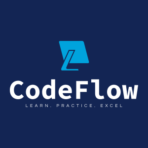

<div align="center">
  


🚀 The intelligent DevOps learning platform that evolves with you.

[](https://flutter.dev)
[](https://nodejs.org)
[](https://firebase.google.com)
[](https://deepmind.google/technologies/gemini/)

</div>

## 🌟 Overview

CodeFlow revolutionizes DevOps learning by combining interactive content, AI assistance, and hands-on practice in one seamless platform. Whether you're taking your first steps in DevOps or fine-tuning your expertise, CodeFlow adapts to your learning journey.

## ✨ Key Features

### Available Now

🎥 **Rich Video Content**
- Comprehensive DevOps tutorials
- Progressive learning paths
- Real-world use cases and examples

🤖 **AI Learning Assistant**
- Powered by Google's Gemini
- Context-aware responses
- Real-time problem solving support

🔐 **Enterprise-Grade Security**
- Secure Firebase authentication
- Protected user data
- Seamless session management

### Coming Soon

⚡ **Interactive Code Playground**
- Live YAML testing environment
- Real-time syntax validation
- Instant feedback system

## 🛠️ Tech Stack

- **Frontend**: Flutter for cross-platform excellence
- **Backend**: Node.js for robust API performance
- **Authentication**: Firebase for secure user management
- **AI Integration**: Gemini for intelligent assistance

## 🚀 Quick Start

### 1. Clone & Setup

```bash
# Get the code
git clone https://github.com/hasnainmakada-99/CodeFlow.git

# Enter the project
cd CodeFlow

# Install dependencies
flutter pub get

# Setup Firebase
flutterfire configure
```

### 2. Launch

```bash
flutter run
```

## 🤝 Contributing

We believe great software is built together. Here's how you can help:

### Contribution Workflow

1. **Fork & Clone**
```bash
git clone https://github.com/your-username/CodeFlow.git
```

2. **Branch Out**
```bash
git checkout -b feature/amazing-feature
```

3. **Commit Changes**
```bash
git commit -m '✨ Add amazing feature'
```

4. **Push & Submit**
```bash
git push origin feature/amazing-feature
```

Then open a Pull Request with a clear description of your changes.

### Best Practices

- Follow the existing code style
- Write meaningful commit messages
- Update documentation as needed
- Add tests for new features

## 📞 Connect With Us

Have questions or ideas? Let's talk!

👤 **Project Maintainer**: Hasnain Makada
- 🐦 Twitter: [@Hasnain_Makada](https://twitter.com/Hasnain_Makada)
- 📧 Email: hasnainmakada@gmail.com

## 🌟 Support CodeFlow

If you find CodeFlow helpful, consider:
- Starring the repository
- Sharing with your network
- Contributing to the codebase

Together, we're building the future of DevOps education! 🚀

---

<div align="center">
  Made with ❤️ by the DevOps community
</div>